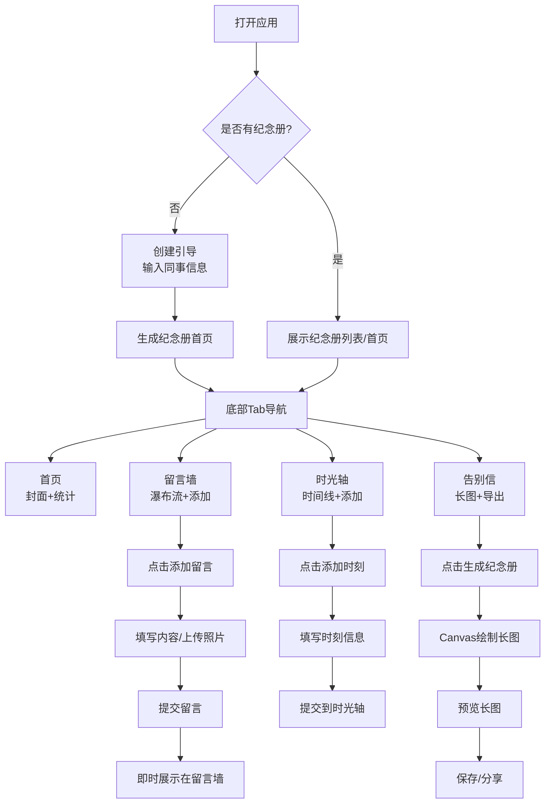

## 1. 产品概述

"共事时光"是一款运行在手机浏览器中的轻量H5纪念工具，专门为即将离职的同事打造。团队成员可共同参与，上传照片、写下祝福、分享共事回忆，最终生成一份专属的离职纪念册。

- **核心价值**：用温暖的数字方式记录团队情谊，为离职同事留下珍贵回忆
- **目标用户**：企业团队、部门同事、创业伙伴等有离职场景的群体
- **产品定位**：完全本地化、无需注册、即用即走的轻量级纪念工具

## 2. 核心功能

### 2.1 用户角色

| 角色 | 权限说明 | 核心功能 |
|------|----------|----------|
| 管理员 | 创建纪念册者，拥有最高权限 | 编辑档案、审核留言、删除时刻、生成长图、导出数据 |
| 普通成员 | 访问纪念册的团队成员 | 查看纪念册、添加留言、添加时光轴时刻、点赞互动 |

### 2.2 功能模块

1. **纪念册首页**：封面展示、同事档案、合影轮播、统计数据
2. **留言墙**：祝福卡片瀑布流、留言添加、心情标签筛选、点赞互动
3. **时光轴**：共事大事记时间线、时刻添加、照片浏览、锚点导航
4. **告别信**：长图生成、预览保存、数据导出、分享功能
5. **纪念册管理**：多册切换、创建引导、数据管理、密码保护

### 2.3 页面详情

| 页面名称 | 模块名称 | 功能描述 |
|---------|----------|----------|
| 纪念册首页 | 封面信息 | 姓名、昵称、入职/离职日期、共事天数、头像 |
| 纪念册首页 | 背景主题 | 预设模板切换、自定义背景上传 |
| 纪念册首页 | 统计数据 | 留言数、参与人数、时刻数 |
| 纪念册首页 | 合影轮播 | 团队照片自动轮播展示 |
| 留言墙 | 卡片瀑布流 | 彩色卡片错落展示，包含头像、心情标签、内容、照片 |
| 留言墙 | 添加留言 | 文字、照片上传、心情标签、姓名/匿名 |
| 留言墙 | 标签筛选 | 按心情标签筛选留言 |
| 留言墙 | 互动功能 | 点赞、感谢回复、热门置顶 |
| 时光轴 | 时间线展示 | 左右布局，按日期排序的事件卡片 |
| 时光轴 | 添加时刻 | 日期、标题、描述、多张照片、事件类型 |
| 时光轴 | 照片浏览 | 点击放大、左右滑动、保存图片 |
| 时光轴 | 自动生成 | 入职日、周年等系统默认时刻 |
| 告别信 | 长图生成 | Canvas绘制竖版长图，含封面、精选留言、时光轴 |
| 告别信 | 预览保存 | 长图预览、保存到相册、系统分享 |
| 告别信 | 数据导出 | JSON/HTML导出、照片打包 |
| 纪念册管理 | 多册管理 | 多本纪念册列表、左右滑动切换 |
| 纪念册管理 | 创建引导 | 首次使用引导流程 |
| 纪念册管理 | 安全设置 | 访问密码、留言审核开关 |

## 3. 核心流程

### 主要用户流程

## 4. 用户界面设计

### 4.1 设计风格

- **主色调**：温暖橙渐变 (#FF8A5B → #FF6B6B)，传递温馨、不舍的情感
- **辅助色**：清新绿 (#4ECDC4)、温柔粉 (#FFE66D)、柔和蓝 (#95E1D3)
- **背景色**：米色渐变背景，营造温暖回忆感
- **按钮风格**：圆润大圆角按钮，渐变填充，微立体阴影
- **字体**：中文使用「思源黑体」/「PingFang SC」，标题字重加粗，正文舒适易读
- **卡片风格**：柔和圆角、轻投影、随机 pastel 背景色
- **图标风格**：线性+填充结合的可爱风格图标，配合emoji增强情感表达
- **整体氛围**：温暖、治愈、有仪式感，像一本精美的纸质纪念册

### 4.2 页面设计概览

| 页面名称 | 模块名称 | UI元素 |
|---------|----------|--------|
| 纪念册首页 | 封面区域 | 大头像圆形裁剪、大号姓名、日期标签、共事天数数字动效 |
| 纪念册首页 | 统计区域 | 三列数据卡片，数字+图标+文字说明 |
| 纪念册首页 | 合影轮播 | 横向滑动卡片，圆角图片，指示器点 |
| 留言墙 | 顶部筛选 | 横向滚动标签栏，选中态高亮 |
| 留言墙 | 瀑布流卡片 | 两列瀑布流，随机颜色卡片，头像首字母，心情标签气泡 |
| 留言墙 | 添加按钮 | 右下角悬浮圆形按钮，渐变色彩 |
| 时光轴 | 时间线 | 左侧竖线+圆点，右侧内容卡片交错排列 |
| 时光轴 | 时刻卡片 | 日期徽章、标题、图片缩略图、描述摘要 |
| 告别信 | 长图预览 | 居中展示可滚动长图，底部操作按钮组 |
| 告别信 | 生成进度 | 进度条动画 + 状态文字 |
| 通用 | 底部导航 | 四个Tab图标+文字，选中态颜色变化 |

### 4.3 响应式设计

- **设计原则**：移动端优先，适配主流手机屏幕尺寸
- **适配范围**：iPhone SE (375px) 到 iPhone Pro Max (430px) 及安卓主流机型
- **布局方式**：Flexbox + CSS Grid 自适应布局
- **触摸优化**：按钮最小点击区域 44x44px，列表项有足够间距
- **横屏适配**：限制竖屏使用提示，或自适应调整布局

### 4.4 动效与交互

- **页面切换**：左右滑动平移过渡，配合Tab切换
- **卡片出现**：渐入+轻微弹起动画，瀑布流卡片错开延迟
- **点赞效果**：心形图标放大弹跳，伴随爱心粒子飘出
- **数字动画**：共事天数、留言数等数字从0滚动到目标值
- **长图生成**：进度条平滑增长，完成后图片渐显放大
- **下拉刷新**：顶部弹性动画，加载旋转图标
- **空状态**：可爱插画+引导文字，渐显出现
