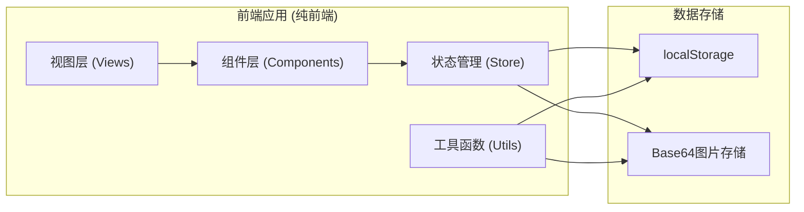
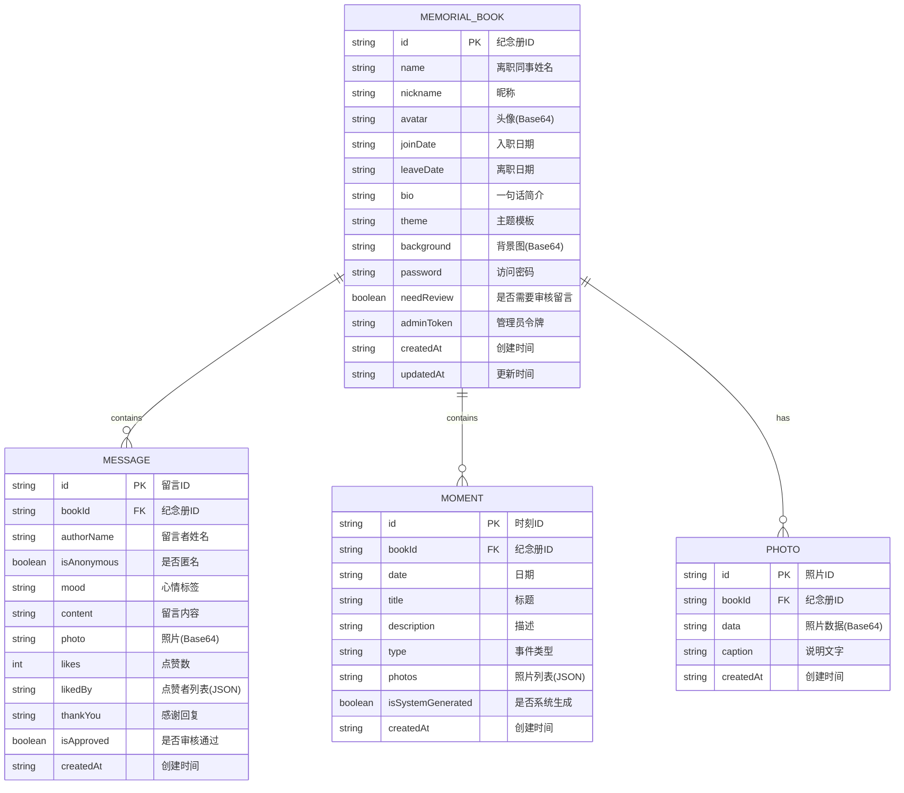

## 1. 架构设计



## 2. 技术描述

- **前端框架**：React 18 + TypeScript
- **构建工具**：Vite 5
- **样式方案**：Tailwind CSS 3 + CSS Modules
- **状态管理**：Zustand (轻量级，适合本地存储场景)
- **路由**：React Router 6 (Hash模式，适配本地文件场景)
- **图片处理**：Canvas API 进行压缩和长图生成
- **数据存储**：localStorage + Base64 编码图片
- **图标**：Lucide React (轻量图标库)
- **动画**：CSS Animations + Framer Motion (可选，视复杂度决定)

## 3. 路由定义

| 路由 | 页面 | 说明 |
|------|------|------|
| `/` | 纪念册首页 | 封面展示、统计数据、合影轮播 |
| `/messages` | 留言墙 | 瀑布流卡片、留言添加、标签筛选 |
| `/timeline` | 时光轴 | 时间线展示、时刻添加 |
| `/farewell` | 告别信 | 长图生成、预览、导出 |
| `/create` | 创建纪念册 | 首次创建引导流程 |
| `/manage` | 纪念册管理 | 多册列表、设置管理 |
| `/edit` | 编辑档案 | 编辑离职同事信息 |

## 4. 数据模型

### 4.1 数据模型定义



### 4.2 数据结构定义 (TypeScript)

```typescript
interface MemorialBook {
  id: string;
  name: string;
  nickname: string;
  avatar: string;
  joinDate: string;
  leaveDate: string;
  bio: string;
  theme: 'warm' | 'fresh' | 'simple' | 'custom';
  background: string;
  password: string;
  needReview: boolean;
  adminToken: string;
  createdAt: string;
  updatedAt: string;
}

interface Message {
  id: string;
  bookId: string;
  authorName: string;
  isAnonymous: boolean;
  mood: 'thanks' | 'sad' | 'bless' | 'happy' | 'miss' | 'cheer';
  content: string;
  photo: string;
  likes: number;
  likedBy: string[];
  thankYou: string;
  isApproved: boolean;
  createdAt: string;
}

interface Moment {
  id: string;
  bookId: string;
  date: string;
  title: string;
  description: string;
  type: 'join' | 'project' | 'team' | 'annual' | 'birthday' | 'daily' | 'other';
  photos: string[];
  isSystemGenerated: boolean;
  createdAt: string;
}

type MoodType = 'thanks' | 'sad' | 'bless' | 'happy' | 'miss' | 'cheer';
type MomentType = 'join' | 'project' | 'team' | 'annual' | 'birthday' | 'daily' | 'other';
type ThemeType = 'warm' | 'fresh' | 'simple' | 'custom';
```

## 5. 目录结构

```
src/
├── components/          # 可复用组件
│   ├── BottomNav.tsx    # 底部导航
│   ├── MessageCard.tsx  # 留言卡片
│   ├── MomentCard.tsx   # 时光轴卡片
│   ├── Avatar.tsx       # 头像组件
│   ├── Button.tsx       # 按钮组件
│   ├── Modal.tsx        # 弹窗组件
│   └── PhotoUpload.tsx  # 照片上传组件
├── pages/               # 页面组件
│   ├── Home.tsx         # 纪念册首页
│   ├── Messages.tsx     # 留言墙
│   ├── Timeline.tsx     # 时光轴
│   ├── Farewell.tsx     # 告别信
│   ├── CreateBook.tsx   # 创建纪念册
│   ├── Manage.tsx       # 纪念册管理
│   └── EditProfile.tsx  # 编辑档案
├── store/               # 状态管理
│   ├── useBookStore.ts  # 纪念册数据store
│   └── useUiStore.ts    # UI状态store
├── utils/               # 工具函数
│   ├── storage.ts       # localStorage操作
│   ├── image.ts         # 图片压缩/处理
│   ├── canvas.ts        # Canvas长图生成
│   ├── date.ts          # 日期工具
│   └── id.ts            # ID生成
├── styles/              # 全局样式
│   ├── index.css        # 主样式文件
│   └── variables.css    # CSS变量
├── types/               # TypeScript类型
│   └── index.ts
├── mock/                # 模拟数据
│   └── sampleData.ts
├── App.tsx              # 应用入口
├── main.tsx             # React入口
└── vite-env.d.ts
```

## 6. 核心技术实现

### 6.1 图片压缩

使用 Canvas API 将上传图片压缩至指定尺寸和质量：
- 最大宽度：800px
- 质量：0.7
- 格式：JPEG
- 目标大小：约200KB以内

### 6.2 长图生成

使用 Canvas API 逐段绘制竖版长图：
1. 顶部：封面区域 (姓名、日期、共事天数)
2. 中部：精选留言 (点赞最多的5条)
3. 下部：时光轴精选 (重要时刻缩略图)
4. 底部：告别语 + 参与同事名单

### 6.3 数据持久化

使用 localStorage 存储所有数据：
- Key 前缀：`gongshi-memorial-`
- 纪念册列表：`gongshi-books`
- 单册数据：`gongshi-book-{id}`
- 用户信息：`gongshi-user`

### 6.4 瀑布流布局

使用 CSS Grid + JavaScript 计算实现两列瀑布流：
- 两列等宽布局
- 卡片依次放入较短列
- 支持响应式调整
